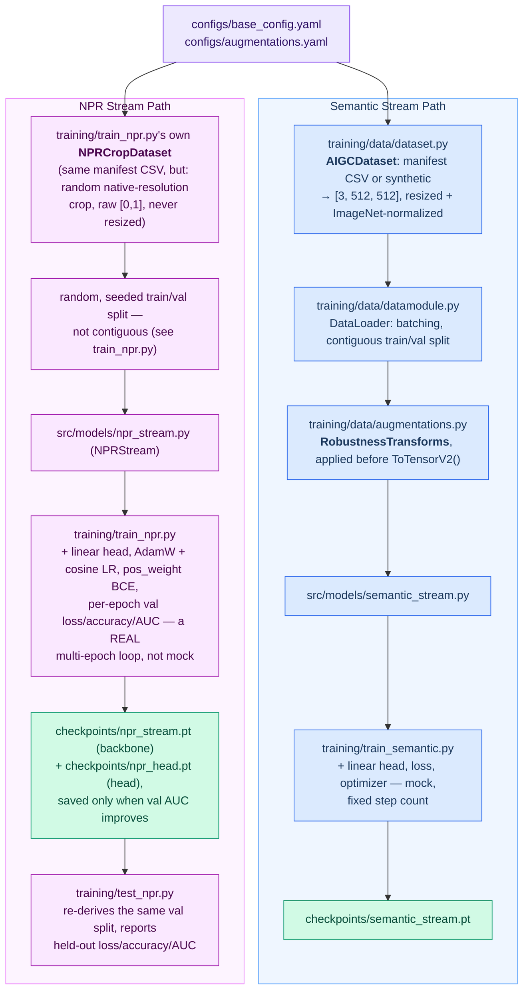
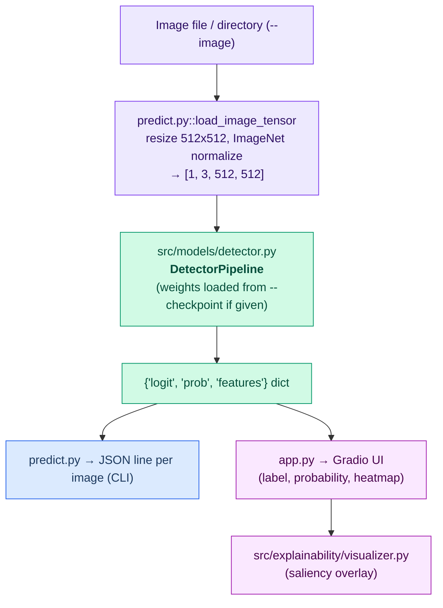

# Architecture: Modular AI Image Detector

This blueprint provides a clean, decoupled skeleton codebase for a hackathon team. It abstracts specific neural network models behind pluggable interfaces, allowing teammates to work in parallel on data pipelines, feature extraction backbones, fusion layers, evaluation benchmarks, and explainability modules without breaking each other's code.

---

## 1. Repository Directory Structure

ai-image-detector/
├── configs/
│ ├── base_config.yaml # Global parameters (batch size, image size, learning rate)
│ ├── augmentations.yaml # Robustness test transform parameters
│ └── model_config.yaml # Hyperparameters for streams and fusion
├── src/ # Shared library code — used by BOTH pipelines
│ ├── **init**.py
│ ├── models/ # Team Member B: Network Architecture
│ │ ├── **init**.py
│ │ ├── base_stream.py # Abstract class for extraction streams
│ │ ├── semantic_stream.py # Stream 1: High-level semantic backbone wrapper
│ │ ├── npr_stream.py # Stream 2: Low-level NPR forensic backbone (default forensic stream)
│ │ ├── frontend_bayar.py # Swappable Bayar+SRM frontend for NPRStream (M3 fallback, see §4.B.3)
│ │ ├── fusion.py # Cross-stream feature fusion layer
│ │ ├── detector.py # End-to-end PyTorch Lightning / PyTorch Module (stub-weight DetectorPipeline)
│ │ ├── fused_detector.py # CanonicalFusedDetector: the real, jointly-scored semantic+forensic+fusion graph
│ │ └── checkpoint_bundle.py # Self-describing bundle contract: builds/loads/validates detector_bundle.pt
│ └── explainability/ # Team Member D: Diagnostic Tools (used by predict.py / app.py)
│ ├── **init**.py
│ ├── contracts.py # Versioned prediction/explanation record schemas (Capability, AttributionTarget, ...)
│ ├── adapters/detector_adapter.py # Explainability boundary for the published CanonicalFusedDetector bundle
│ ├── gradcam.py # Model-independent Grad-CAM (forward/backward hooks + CAM math)
│ ├── attribution.py # Vanilla gradients / Integrated Gradients
│ ├── attention_rollout.py # Attention-rollout primitive (unsupported for this model, see §4.E)
│ ├── branch_contributions.py # Coalition/ablation logit attribution across fused branches
│ ├── faithfulness.py # Deletion/insertion faithfulness curves for a given heatmap
│ ├── render.py # Heatmap normalization, colormaps, PNG rendering
│ ├── serialization.py # JSON explanation envelopes, lossless NPY artifacts, JSONL I/O
│ └── artifacts.py / rendering.py / visualizer.py # Legacy scaffolding for the stub DetectorPipeline, superseded by the above for the published bundle
├── training/ # Training pipeline — everything only the offline pipeline needs
│ ├── **init**.py
│ ├── train_semantic.py # Trains the semantic stream in isolation, saves a checkpoint
│ ├── train_npr.py # Trains the NPR stream in isolation: real multi-epoch loop, own crop dataset
│ ├── train_bayar_srm.py # Trains NPRStream with the Bayar+SRM frontend swapped in
│ ├── train_fusion.py # Fuses two frozen, already-trained streams + trains the classification head
│ ├── build_detector_bundle.py # Packages the 3 trained checkpoints into the self-describing detector_bundle.pt (parity-checked against an independent 3-file scorer)
│ ├── test_npr.py / evaluate_npr.py # Evaluate a trained NPR checkpoint (held-out split / resize stress test)
│ ├── evaluate_bayar_srm.py # Same, for the Bayar+SRM checkpoint
│ ├── evaluate.py # Main evaluation CLI against benchmark transforms
│ ├── data/ # Team Member A: Data & Augmentations
│ │ ├── **init**.py
│ │ ├── dataset.py # Custom Dataset class loading Real/AI images
│ │ ├── augmentations.py # Robustness transform pipeline (Albumentations)
│ │ ├── datamodule.py # PyTorch DataLoader wrapper
│ │ ├── import_hf.py # Streams a real HF image dataset into a local manifest CSV
│ │ └── shuffle_manifest.py # Shuffles a manifest's rows before training reads it
│ └── evaluation/ # Team Member C: Benchmark & Metrics
│ ├── **init**.py
│ ├── robustness_suite.py # Automated robustness test runner across transforms
│ ├── metrics.py # Accuracy, ROC-AUC, F1, degradation curve tools
│ ├── calibration.py # ECE, reliability bins, Brier score
│ ├── schemas.py # Versioned report/record schemas
│ └── report.py # JSON-serializable report assembly
├── tests/ # Integration and unit tests
├── predict.py # Inference pipeline: single-image / Batch prediction + explanation CLI (loads checkpoints/detector_bundle.pt)
├── evaluate_predict.py # Evaluates the checkpoint trio against a labeled manifest
├── app.py # Inference pipeline: Gradio frontend
├── requirements.txt # Dependencies
├── README.md # Setup and usage guide
├── ABOUT.md # Project writeup: motivation, learnings, what's next
└── ARCHITECTURE.md # This file

---

## 2. Pipeline Data Flow: Training vs. Inference

The repository has **two independent entry-point pipelines** that both sit on top of
the same `src/` modules but never call into each other. Keeping their entry scripts
separated (`training/` vs. root-level `predict.py` / `app.py`) is what makes it safe
for the data/model/eval workstreams to iterate without breaking the demo, and vice
versa.

### Training Pipeline (offline, produces per-stream checkpoints)

The two feature-extraction streams are trained **independently** (their own
script, their own checkpoint) so two teammates can research each backbone in
parallel without touching the same file. Neither touches `fusion.py` -- joint
fine-tuning of the fused `DetectorPipeline` is future work (`TODO.md` §3).

Unlike the original two-stream design, the semantic and NPR paths do **not**
share one data pipeline: NPR's residual signal is destroyed by resizing, so
it can't go through the same resize-to-512 + ImageNet-normalize step the
semantic stream needs. Each stream therefore owns its own dataset class.

Real data for either path comes from `training/data/import_hf.py` (streams a
Hugging Face dataset into a local `image_path,label` manifest CSV) piped
through `training/data/shuffle_manifest.py`, then pointed to by
`configs/base_config.yaml`'s `data.manifest_path` -- both dataset classes
fall back to an in-memory synthetic dataset if that path doesn't exist yet.

`training/evaluate.py` currently benchmarks the full (randomly-initialized,
unless `--checkpoint` is given) fused `DetectorPipeline` directly -- it does
not yet load the per-stream checkpoints above into it, and note that a raw
`NPRStream` checkpoint's keys won't match `DetectorPipeline`'s
`forensic_stream.*`-prefixed keys without remapping; wiring that up is
tracked in `TODO.md` §3/§4.

Entry points: `python -m training.train_semantic --config configs/base_config.yaml`,
`python -m training.train_npr --config configs/base_config.yaml`,
`python -m training.test_npr --config configs/base_config.yaml`, and
`python -m training.evaluate --checkpoint <ckpt> --config configs/augmentations.yaml`,
all run from the repo root (see [`.claude/CLAUDE.md`](.claude/CLAUDE.md)).

### Inference Pipeline (online, consumes a checkpoint)

Entry points: `python predict.py --image <path> [--checkpoint <ckpt>]` and
`python app.py` (Gradio server), both at the repo root.

The diagram above is the stub `DetectorPipeline` path. In practice both entry
points prefer `checkpoints/detector_bundle.pt` when present: `predict.py`/
`app.py` load it through `src/models/checkpoint_bundle.py` into a
`CanonicalFusedDetector` (`src/models/fused_detector.py`) instead of the
random/stub-weight `DetectorPipeline`, and `VIZ` in the diagram becomes real
Grad-CAM / faithfulness / attribution output via
`src/explainability/adapters/detector_adapter.py` rather than a placeholder
saliency map — see [§4.E](#e-explainability-module-srcexplainability) for
that path in detail.

The two pipelines share `src/models/` and the `[B, 3, H, W] -> {logit, prob, features}`
contract. `training/data/` and `training/evaluation/` live entirely inside
`training/` and are never imported by `predict.py` or `app.py`; `src/explainability/`
is the reverse — inference-only, never imported by `training/`.

## 3. Core Data Contracts & Tensor Flow

To ensure all components seamlessly connect, teammates must strictly follow these standardization contracts:

| Stage                   | Input Artifact               | Output Artifact                      | Interface / Function            |
| ----------------------- | ---------------------------- | ------------------------------------ | ------------------------------- |
| **Data Ingestion**      | Raw image path (`str`)       | Tensor `[B, 3, H, W]`                | `ImageDataset.__getitem__()`    |
| **Augmentation**        | Clean Tensor `[B, 3, H, W]`  | Transformed Tensor `[B, 3, H, W]`    | `AugmentationEngine.apply()`    |
| **Stream 1 Extraction** | Tensor `[B, 3, H, W]`        | Feature Tensor `[B, D1]`             | `SemanticStream.forward()`      |
| **Stream 2 Extraction** | Tensor `[B, 3, H, W]`, raw `[0,1]` native crop (NOT resized/normalized -- see below) | Feature Tensor `[B, D2]` | `NPRStream.forward()`     |
| **Fusion Layer**        | Tensors `([B, D1], [B, D2])` | Unified Vector `[B, D_fused]`        | `FusionModule.forward()`        |
| **Classification**      | Vector `[B, D_fused]`        | Logit `[B, 1]` / Prob `[0.0 to 1.0]` | `ClassificationHead.forward()`  |
| **Explainability**      | Image Tensor + Model         | Spatial Saliency Matrix `[H, W]`     | `Visualizer.generate_heatmap()` |

Note Stream 2's input diverges from every other row's `[B, 3, H, W]` shorthand:
NPR's residual is destroyed by resizing, so it must receive a raw, un-normalized,
native-resolution crop rather than the resized + ImageNet-normalized tensor the
other rows assume. `D2` is 256 by default (`resnet_shallow` backbone) or 768 with
the `convnext_tiny` ablation -- read `NPRStream.output_dim` rather than hardcoding.

---

## 4. Modular Component Blueprint

### A. Data & Augmentation Module (`training/data/`)

**Responsibility:** Load dataset pairs, apply standardized spatial cropping, and simulate real-world degradations (JPEG compression, blur, noise, downscaling) during both training and robustness testing.

Key classes to implement:

- `RobustnessTransforms`: Configurable wrappers using `Albumentations` or `TorchVision` to dynamically inject JPEG degradation (quality in [30, 90]), Gaussian Blur (sigma in [0.5, 2.0]), Rescaling (0.25x to 0.5x), Gaussian Noise, Color Jitter, and Center Cropping (80%).
- `AIGCDataset`: PyTorch `Dataset` that reads a manifest CSV (`image_path, label`) where real images are labeled `0` and AI-generated images are labeled `1`.

### B. Feature Extraction Streams (`src/models/`)

**Responsibility:** Implement two isolated extraction backbones that convert input image tensors into fixed-size feature vectors.

1. **Abstract Base Interface (`base_stream.py`)**:
   Defines a standardized PyTorch interface `BaseFeatureStream` with an abstract method `extract_features(x: torch.Tensor) -> torch.Tensor`.
2. **Stream 1: High-Level Semantic Stream (`semantic_stream.py`)**:

- _Purpose_: Extracts deep semantic and contextual representations resilient to surface noise and downsampling.
- _Wrapper Contract_: Accepts `[B, 3, H, W]`, outputs a high-level representation vector `[B, D1]`. Any suitable vision foundation backbone can be plugged into this class without changing downstream code.

3. **Stream 2: Low-Level Forensic / NPR Stream (`npr_stream.py`)**:

- _Purpose_: Reads the Neighboring Pixel Relationships (NPR) residual -- a fixed, parameter-free nearest-neighbour downsample-upsample round trip subtracted from the input -- which isolates the periodic local-correlation pattern every GAN/diffusion decoder's final upsampling stack leaves behind. Reference: Tan et al., CVPR 2024.
- _Wrapper Contract_: Accepts raw `[0, 1]` pixels at a native-resolution crop `[B, 3, H, W]` (never resized -- resizing overwrites the exact artifact this stream reads), computes the residual, rescales it with `BatchNorm2d`, and reads it with a backbone to output `[B, D2]`. Both the residual frontend and the backbone are swappable via constructor args (`frontend=`, `backbone=`).
- The resize/downscale stress test (`training/evaluate_npr.py`) confirmed the fixed NPR operator collapses toward chance under aggressive rescaling, so the frontend swap point is exercised for real: `frontend_bayar.py`'s `BayarSRMFrontend` (a learnable Bayar constrained conv + fixed SRM filters) plugs into the identical interface as `NPRStream(frontend=BayarSRMFrontend())` -- this is what the published pretrained weights and the `detector_bundle.pt` bundle `predict.py`/`app.py` load use. `DetectorPipeline`'s default `forensic_stream` still uses plain `NPR`, since that default path is a shape-correct stub, not the trained model (see [Section 2](#2-pipeline-data-flow-training-vs-inference)).

### C. Fusion & Classification Head (`src/models/fusion.py` & `detector.py`)

**Responsibility:** Combine feature representations from Stream 1 and Stream 2, process them through a fusion layer (e.g., Concatenation, Cross-Attention, or Bilinear Pooling), and predict the final probability score.

Key classes to implement:

- `FeatureFusion`: Accepts `feat_stream1` and `feat_stream2`, merges them, and applies normalization.
- `DetectorPipeline`: Main wrapper holding Stream 1, Stream 2, Fusion, and a final Multi-Layer Perceptron (MLP) classification head. Returns a dictionary containing prediction logits, probabilities, and intermediate feature vectors:
  `Output Dict = {'logit': Tensor[B, 1], 'prob': Tensor[B, 1], 'features': Tensor[B, D_fused]}`

### D. Evaluation Suite (`training/evaluation/`)

**Responsibility:** Automate evaluation across specific transformation suites to compute degradation curves (e.g., Accuracy vs. JPEG Quality Factor).

Key tasks to implement:

- `RobustnessBenchmark`: Runs the model against transformed test sets and outputs performance metrics per transform severity:
- Accuracy
- ROC-AUC
- False Positive Rate (FPR) at 95% True Positive Rate (TPR)

- Generates structured output tables (CSV/JSON) summarizing metric degradation across transformation parameters.

### E. Explainability Module (`src/explainability/`)

**Responsibility:** Provide diagnostic maps indicating which image patches or features triggered the classification score.

Unlike the other sections above, this one describes what was actually built,
not just the original blueprint task list -- the module is real and wired to
the published `CanonicalFusedDetector` bundle, not a placeholder.

**Design: model-independent primitives + one adapter, not one bespoke
implementation per model.** `src/explainability/` (`gradcam.py`,
`attribution.py`, `attention_rollout.py`, `branch_contributions.py`,
`faithfulness.py`) implements each attribution technique once, generically,
against `nn.Module` hooks and plain tensors. `src/explainability/adapters/
detector_adapter.py` is the single place that knows about the fused
detector: it resolves the contract's named target paths (below) into actual
submodules on `CanonicalFusedDetector`, prepares model inputs via
`fused_detector.prepare_fused_inputs`, and returns results shaped to
`contracts.py`'s schemas. `predict.py --explanation-method ...` and `app.py`'s
explanation views both call through this one adapter -- neither talks to
`gradcam.py`/`attribution.py` directly.

**Supported explanation modes** (see `docs/final_model_contract.md` for the
authoritative target-path list, which the bundle manifest also embeds):

- **Semantic Grad-CAM** -- `gradcam.py` hooked at
  `semantic_stream.backbone.encoder.layers.encoder_layer_11.ln_1`.
  `detector_adapter.vit_token_grid` strips the CLS token and reshapes the
  196 remaining patch tokens to a `14x14` grid before CAM math runs.
- **Forensic Grad-CAM** -- hooked at `forensic_stream.backbone.4.2.conv3`,
  producing a native `128x128` grid.
- **Bayar+SRM fused intermediate** -- a non-class-conditioned dump of
  activity at `frontend.bayar`, `frontend.srm`, `frontend.fuse`,
  `backbone.4`, or `pool`; shows what the forensic frontend produced before
  the backbone/classifier ever sees it.
- **Semantic Integrated Gradients** (`attribution.py`) -- an explicit,
  opt-in, more expensive alternative to Grad-CAM for the semantic branch.
- **Deletion/insertion faithfulness** (`faithfulness.py`) -- given a named
  heatmap (typically forensic Grad-CAM), progressively deletes/inserts the
  highest-ranked raw-image patches and tracks the logit curve, as a sanity
  check that the heatmap the model produced is actually load-bearing for its
  own prediction.

**Explicitly unsupported, and reported as such rather than faked**
(`contracts.py`'s `CapabilityStatus` distinguishes "unsupported" from a
computed result so `predict.py`/`app.py` never silently return a
meaningless map):

- **Attention rollout** (`attention_rollout.py`) -- the primitive exists and
  is unit-tested, but is unsupported for this model because torchvision's
  ViT forward path doesn't expose intermediate attention matrices to hook.
- **Branch-coalition / feature-ablation logits** (`branch_contributions.py`)
  -- the primitive exists, but is unsupported for the published bundle
  because it doesn't embed a trained feature-ablation baseline; the code
  deliberately refuses to substitute zeros as an implicit baseline, since
  that would misrepresent a branch's contribution.

**Output contract.** `render.py` turns a raw attribution tensor into a
normalized, colormapped PNG at consistent display resolution (nearest-
neighbor upscale for the semantic `14x14` grid so patch boundaries stay
honest; bilinear for the forensic `128x128` grid). `serialization.py` writes
the paired lossless `.npy` array and a versioned `explanation.json` envelope
per `contracts.py`, recording native grid size, display size, interpolation,
coordinate space, and the model/preprocessing identity the explanation was
computed against -- so a saved explanation is never ambiguous about what
produced it. Default output directory is `outputs/explanations/<sample-id>/`.

**Bundle-level guarantee.** `src/models/checkpoint_bundle.py`'s
`validate_explainability_contract` checks at bundle-build time
(`training/build_detector_bundle.py`) that every target/intermediate path the
contract declares actually resolves against the canonical module tree --
explainability target paths can't silently go stale as the model code
changes without the bundle build failing first.

---

## 5. Parallel Workstreams & Task Allocation

To maximize team efficiency during a hackathon, team members can work simultaneously on separate modules using mock interfaces:

| Team Member  | Module Focus                    | Primary Deliverables                                                    | Independence Strategy (Mocking)                                                                                                               |
| ------------ | ------------------------------- | ----------------------------------------------------------------------- | --------------------------------------------------------------------------------------------------------------------------------------------- |
| **Member A** | **Data & Augmentations**        | `dataset.py`, `augmentations.py`, transform parameters configuration    | Can build data loaders and test transformations on dummy images independently of model development.                                           |
| **Member B** | **Model & Fusion Architecture** | `semantic_stream.py`, `npr_stream.py`, `fusion.py`, `detector.py` | Can build backbone wrappers using lightweight stub networks (e.g., simple CNNs) to verify tensor shapes before dropping in pretrained models. |
| **Member C** | **Evaluation & Robustness**     | `robustness_suite.py`, `metrics.py`, `training/evaluate.py`             | Can write the evaluation benchmark runner using a dummy model that outputs random logits to ensure metric calculation works.                  |
| **Member D** | **Explainability & Scripts**    | `visualizer.py`, `predict.py`, CLI interface, documentation             | Can develop visualization scripts using random gradient tensors or mock spatial attention maps.                                               |

---

## 6. Execution Strategy

1. **Step 1: Set Up Interfaces**: Clone repository, build virtual environment, and verify that `training/train_semantic.py` and `training/train_npr.py` run using dummy input tensors and basic placeholder backbones.
2. **Step 2: Component Implementation**: Team members complete their respective modules using the agreed-upon data contracts.
3. **Step 3: Integration**: Replace stub models with actual pretrained extraction backbones and connect real datasets to the robust augmentation pipeline.
4. **Step 4: Benchmarking**: Run `training/evaluate.py` to test performance under JPEG compression, blur, downscaling, noise, jitter, and cropping, generating final metrics and visual heatmaps.
