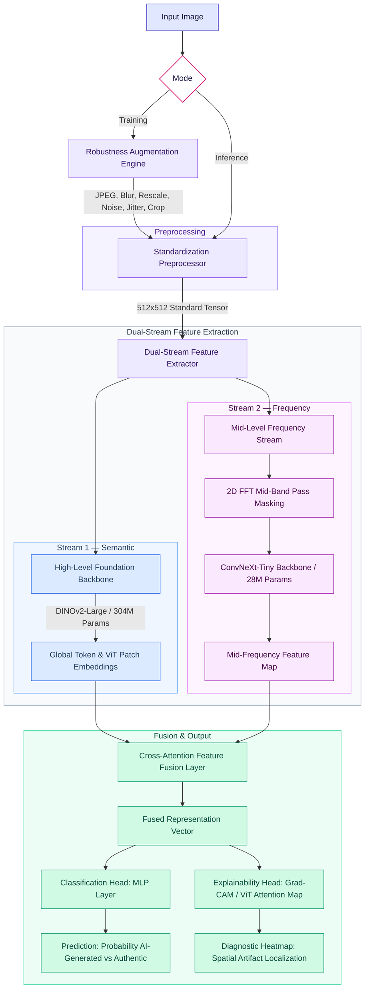

# RAID — Robust AI-generated Image Detector

Catch AI fakes before they slip past you. RAID is a modular, dual-stream
framework for detecting AI-generated images that stays accurate under
real-world post-processing (JPEG re-compression, blur, rescaling, noise,
color jitter, and cropping) — the kind of degradation a photo actually goes
through before it reaches someone in a group chat.

## Overview

AI-generated imagery has gotten good enough that the people most exposed to
AI scam ads, fake product photos, and fabricated "news" images — often the
least equipped to question them — can no longer just eyeball a photo and
tell. RAID aims to sit between an image and a person and give a straight
answer: *this was probably made by AI*, with a probability and (eventually)
a visual explanation of why.

The architecture combines two independent feature-extraction streams behind
a shared `BaseFeatureStream` interface:

- **Semantic stream** — a ViT-B/16 backbone (optionally with the last few
  transformer blocks fine-tuned) that reasons about high-level content,
  composition, and semantic irrelevancies (impossible anatomy, warped text,
  inconsistent lighting).
- **Forensic stream** — reads low-level generation artifacts that survive
  resizing and re-compression. The active implementation is **NPR**
  (Neighboring Pixel Relationships): a fixed, parameter-free
  downsample/upsample residual that isolates the periodic pattern every
  GAN/diffusion decoder's upsampling stack leaves behind (Tan et al., CVPR
  2024). A swappable Bayar constrained-conv + SRM-filter frontend was also
  built behind the same interface as an alternative, and is what the
  currently published pretrained weights use.

Both streams feed a fusion layer and a compact classification head, capped
under a **2B parameter budget** (target ~337M) so the whole pipeline stays
fast enough for hackathon-scale, single-GPU iteration.

### Architecture

This is the original blueprint design the project was scaffolded from (backbone
names/params are the initial targets — see the stream bullets above and
[Limitations](#limitations--what-wed-improve-with-more-time) for what the
active implementation actually uses):



Full module ownership and data-flow diagrams for the current implementation
live in [`architecture.md`](architecture.md); the shared
tensor contracts and coding conventions the team held each other to are in
[`.claude/CLAUDE.md`](.claude/CLAUDE.md); the fuller writeup of what we
learned and why we made the calls we did is in [`ABOUT.md`](ABOUT.md).

**Status:** the semantic and forensic (NPR / Bayar+SRM) streams both train
and evaluate meaningfully on their own. A real, jointly-trained pipeline —
semantic + Bayar+SRM + fusion — is published and gives meaningful
predictions today via `predict.py --bayar` (see [Reproducing our
results](#reproducing-our-results) below). The default `DetectorPipeline`
(semantic + a plain NPR forensic stream) still runs on stub weights for the
forensic stream and fusion layer, so its raw predictions aren't meaningful
yet — this is what's left for a fully joint fine-tune.

## Setup and Installation

**Prerequisites:** Python 3.10+. An NVIDIA GPU with CUDA speeds up both
training and inference, but everything also runs on CPU.

```bash
git clone https://github.com/RAID-techjam/RAID.git
cd RAID

python -m venv .venv
```

Activate the virtual environment:

```bash
# macOS/Linux
source .venv/bin/activate

# Windows (PowerShell)
.venv\Scripts\Activate.ps1
```

Install dependencies:

```bash
pip install -r requirements.txt
```

This installs PyTorch/torchvision, Albumentations, `timm`-adjacent vision
tooling, Gradio (the demo frontend), scikit-learn (evaluation metrics), and
`datasets` (for streaming training data from the Hugging Face Hub). Set
`configs/base_config.yaml`'s `semantic.pretrained: true` to download
torchvision's ImageNet-pretrained ViT-B/16 weights on first run; the default
(`false`) keeps everything offline for smoke tests.

## Reproducing Our Results

### 1. Verify the tensor contracts

Sanity-checks that Stream 1, Stream 2, Fusion, and the Detector output all
match the shapes defined in `.claude/CLAUDE.md`:

```bash
python -c "
import torch
from src.models.detector import DetectorPipeline

x = torch.randn(2, 3, 512, 512)
out = DetectorPipeline()(x)
assert out['logit'].shape == (2, 1)
assert out['prob'].shape == (2, 1)
assert out['features'].shape == (2, 512)
print('Tensor contracts OK:', {k: tuple(v.shape) for k, v in out.items()})
"
```

### 2. Run inference with our pretrained (real) weights

The meaningful, jointly-trained pipeline — semantic (ViT-B/16) + Bayar+SRM
forensic stream + fusion — is published on the Hugging Face Hub as
`RAID-techjam/raid-detector-fusion`:

```bash
pip install huggingface_hub
hf download RAID-techjam/raid-detector-fusion --repo-type model --local-dir checkpoints

python predict.py --image test_sample.jpg --bayar \
  --checkpoint checkpoints/detector_fusion.pt \
  --semantic-checkpoint checkpoints/semantic_stream.pt \
  --bayar-checkpoint checkpoints/bayar_srm_stream.pt
```

This prints one JSON line with the AI-generated probability, label, and
inference time. `--bayar` is required — it routes through the Bayar-aware
fusion checkpoint instead of the default stub `DetectorPipeline`. `--image`
also accepts a directory for batch inference (one JSON line per image).

You can also evaluate this checkpoint trio against a labeled manifest
(`image_path,label` CSV) to get accuracy, a confusion matrix, and AUC:

```bash
python evaluate_predict.py --manifest path/to/manifest.csv \
  --checkpoint checkpoints/detector_fusion.pt \
  --semantic-checkpoint checkpoints/semantic_stream.pt \
  --bayar-checkpoint checkpoints/bayar_srm_stream.pt
```

**Reported numbers:** on a 10,000-image `SID_Set` subset, the Bayar+SRM
model reached ~0.8738 clean validation AUC. Resize robustness improved after
training with resize augmentation, reaching ~0.8459 AUC at 0.5x scale, while
more aggressive 0.25x–0.35x scale conditions remained challenging. The NPR
stream alone (evaluated independently, not yet fused) reached ~0.91 val AUC
on its own held-out split. Treat all of these as hackathon-scale, not
production-grade, numbers — see [Limitations](#limitations--what-wed-improve-with-more-time).

### 3. Launch the demo app

```bash
python app.py
```

Starts a local Gradio server. Upload a `.jpg`/`.png`/`.webp` image and click
**Run** to see the predicted label, the P(AI-Generated) percentage, and a
(currently placeholder) saliency overlay. `app.py` auto-detects the
pretrained checkpoint trio in `checkpoints/` (step 2) and routes through the
real Bayar+SRM fusion model when present, falling back to the stub
`DetectorPipeline` otherwise — a status line under the title always states
which one is active.

### 4. Run the test suite

```bash
pytest tests/
```

### 5. (Optional) Train the pipeline from scratch

Pull a real labeled subset from the Hugging Face Hub without downloading it
in full, then shuffle it into train/val order:

```bash
python -m training.data.import_hf --dataset RAID-techjam/SID_Set --split train --limit 10000 --output data/sid_subset
python -m training.data.shuffle_manifest --input data/sid_subset/manifest.csv --output data/sid_subset/manifest.csv
```

Point `configs/base_config.yaml`'s `data.manifest_path` at the resulting
manifest, then train each stream independently:

```bash
# Semantic stream (ViT-B/16 + linear head)
python -m training.train_semantic --config configs/base_config.yaml

# Forensic stream — pick one:
python -m training.train_npr --config configs/base_config.yaml        # NPR (parameter-free residual)
python -m training.train_bayar_srm --config configs/base_config_bayar.yaml  # Bayar+SRM (what the published weights use)

# Fuse the two frozen streams + train the classification head
python -m training.train_fusion --config configs/base_config.yaml \
  --semantic-checkpoint checkpoints/semantic_stream.pt \
  --forensic-checkpoint checkpoints/bayar_srm_stream.pt
```

Each script falls back to an in-memory synthetic dataset if
`data.manifest_path` isn't set, so every step above is runnable end-to-end
without real data as a smoke test. Evaluate a trained stream standalone with
`training/test_npr.py` / `training/evaluate_bayar_srm.py` (the latter also
runs the resize/downscale robustness stress test), or benchmark the fused
pipeline with `training/evaluate.py`.

## Limitations & What We'd Improve With More Time

- **Joint fusion fine-tuning is unfinished.** The semantic and forensic
  streams have each been validated independently, but the default
  `DetectorPipeline` fusion path isn't jointly fine-tuned end-to-end —
  `predict.py --bayar` covers a real trained pipeline today, but it's a
  separate path from the one described in the original architecture, not a
  drop-in replacement for it.
- **The forensic branch isn't fully settled.** We built two candidate
  frontends (parameter-free NPR, and Bayar constrained-conv + SRM) behind a
  swappable interface, but haven't finished the resize/downscale stress test
  needed to say definitively which one holds up better under aggressive
  rescaling — the published weights use Bayar+SRM, but NPR alone scores
  higher on clean val AUC.
- **Robustness is only spot-checked, not fully benchmarked.** We built the
  full degradation pipeline (JPEG Q30–90, blur, 0.25x–0.5x rescale, noise,
  jitter, 80% crop) and the eval scaffolding, but haven't yet generated the
  full accuracy-vs-severity degradation curves across every transform — only
  targeted resize/downscale numbers reported above.
- **Explainability is a placeholder.** The saliency overlay in the demo app
  is a mock; Grad-CAM / attention-rollout wired to the real fused model is
  what would turn "probably AI" into "probably AI, and here's why."
  Model-independent scaffolding for this already exists (metrics,
  calibration, rendering, output contracts) — what's missing is the actual
  attribution logic.
- **Training data is a hackathon-scale subset.** Results above come from a
  partial pull (10K images) from `SID_Set`, not the full dataset. Scaling up
  training data is the single biggest lever left for real accuracy gains.
- **No CI yet.** `pytest tests/` runs locally but isn't wired into GitHub
  Actions, so regressions can currently slip into a checkpoint unnoticed.

With more time, the priority order would be: finish joint fusion training →
settle NPR vs. Bayar+SRM with the resize stress test → run the full
robustness benchmark → ship real explainability → scale up the dataset.

## Team Member Contributions

RAID was built by a 4-person team, split along the same lines as the
architecture so nobody had to block on someone else's unfinished module:

- **morpheuschoo** — Model & training pipeline lead: the semantic stream
  (`src/models/semantic_stream.py`), its training loop
  (`training/train_semantic.py`), fusion training
  (`training/train_fusion.py`), base configs, and the Hugging Face data
  importer.
- **Goh Jin Yu ([@Beastarz](https://github.com/Beastarz))** — Scaffolding,
  docs, and inference frontend: the original project blueprint/skeleton
  (`architecture.md`, `.claude/CLAUDE.md`, `TODO.md`), the data loader and
  augmentation pipeline scaffolding, the Gradio demo (`app.py`), and this
  README.
- **Shawn Wee ([@McFishhh](https://github.com/McFishhh))** — Forensic stream
  lead: the NPR stream (`src/models/npr_stream.py`,
  `training/train_npr.py`), the swappable Bayar+SRM frontend
  (`src/models/frontend_bayar.py`, `training/train_bayar_srm.py`), and their
  standalone robustness evaluation scripts.
- **Shen Yu Chen, Keith ([@blurfrost](https://github.com/blurfrost))** —
  Evaluation & explainability lead: the metrics/calibration/reporting suite
  (`training/evaluation/`) and the explainability contracts and visualizer
  scaffolding (`src/explainability/`), plus their corresponding tests.

See [`ABOUT.md`](ABOUT.md) for the full write-up of what we learned, the
challenges we hit, and what's next.

## Contributing

Follow the module ownership, tensor contracts, and coding conventions
defined in [`.claude/CLAUDE.md`](.claude/CLAUDE.md) before opening a PR. In
particular:

- Keep total model parameters under 2B (target ~337M).
- Never modify `src/models/base_stream.py` without team consensus.
- Apply augmentations before `ToTensorV2()`.
- Always use `torch.device("cuda" if torch.cuda.is_available() else "cpu")`.
- Run `pytest tests/` before committing.
